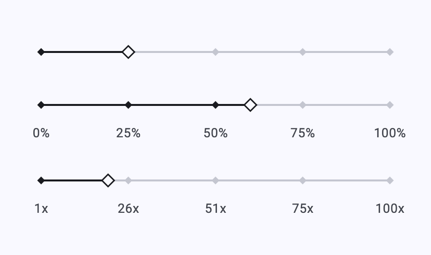
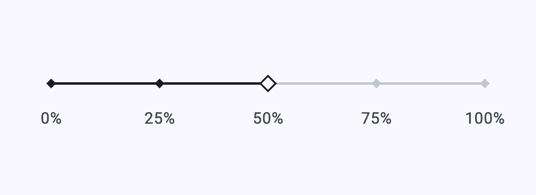
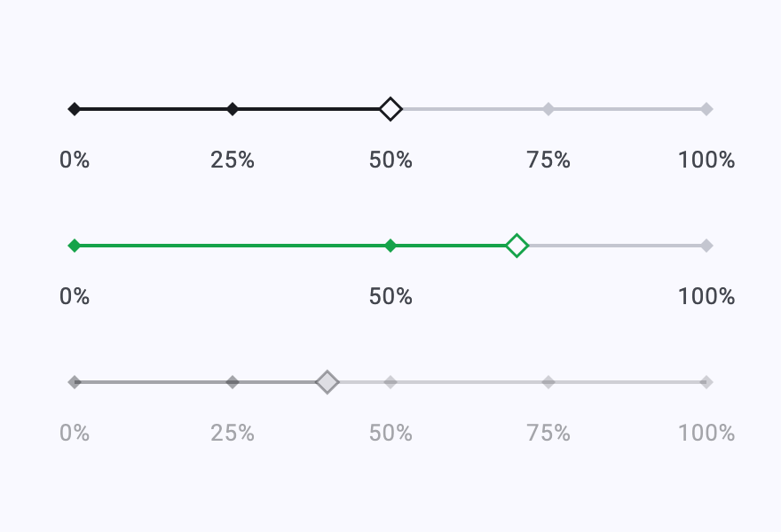
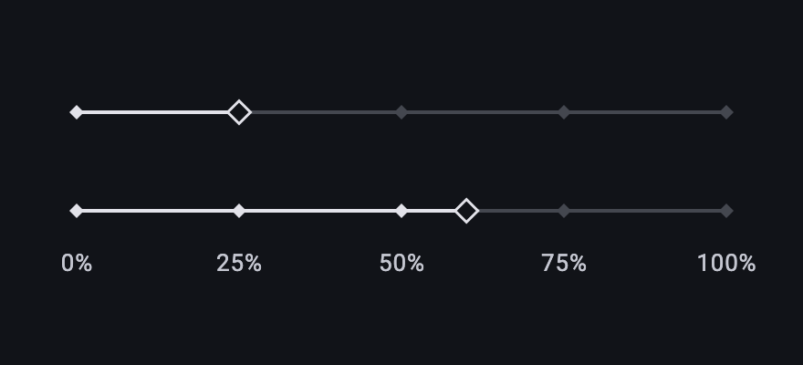

# diamond_percent_slider

A Material-style integer slider with a diamond track, diamond ticks and a
thumb that gently tilts in the direction of travel. It is designed for
percentage, leverage and other compact numeric choices, while retaining the
keyboard interaction and accessibility behaviour of Flutter's `Slider`.





## Features

* Integer ranges with guaranteed step snapping.
* A configurable number of scale nodes, independent of the selectable step.
* Optional labels and independent value-indicator formatting.
* Light/dark colour defaults plus `DiamondSliderTheme` for app-wide styling.
* A disabled state, keyboard controls and screen-reader value semantics.
* Right-to-left layouts, where the scale and its labels mirror, and the thumb
  still leans the way the finger moves.
* A haptic tick on each step change, off with `enableFeedback: false`.
* Public track, thumb, tick-mark and value-indicator shapes for use with a
  plain `Slider`.

## Install

```yaml
dependencies:
  diamond_percent_slider: ^1.0.1
```

The package requires Flutter 3.47 or newer and uses `material_ui` for its
Material primitives. That covers Android, iOS, macOS, Windows and Linux; web is
not among them, because `material_ui` reaches for `dart:io`.

## Usage

```dart
int leverage = 25;

DiamondPercentSlider(
  value: leverage,
  min: 5,
  max: 100,
  step: 5,
  nodes: 5,
  showLabels: true,
  labelFormatter: (value) => '${value}x',
  onChanged: (value) => setState(() => leverage = value),
)
```

`step`, `nodes` and the per-instance colours cover the rest of the shape of the
control, including a disabled slider, which dims its labels along with it:



No setup is required: colours derive from the ambient `ColorScheme`. To style
every slider, register a `DiamondSliderTheme` in `ThemeData.extensions`:

```dart
ThemeData(
  extensions: const [
    DiamondSliderTheme(
      activeColor: Color(0xFF16A34A),
      inactiveColor: Color(0xFFE5E7EB),
      indicatorColor: Color(0xFF166534),
    ),
  ],
)
```

The defaults follow the theme's brightness, so a dark app needs no extra
configuration:



`labelFormatter`, `indicatorFormatter` and `semanticFormatter` let the scale,
value bubble and screen-reader announcement use the wording appropriate to
your domain. See the runnable [example](example) for light, dark, disabled and
custom-colour variants.

## Development

Run `flutter analyze` and `flutter test` from the package root.

Golden tests under `test/goldens` cover what the slider paints. Their baselines
are macOS-rendered, so CI skips them with `--exclude-tags golden` and they stay
a local pre-release check. Regenerate after an intended visual change:

```sh
flutter test --update-goldens
```

The example's golden tests regenerate the README screenshots — every image
here except the hand-recorded tilt animation — with:

```sh
cd example
flutter test --update-goldens test/screenshots_test.dart
```

Issues and contributions are welcome in the package repository.
